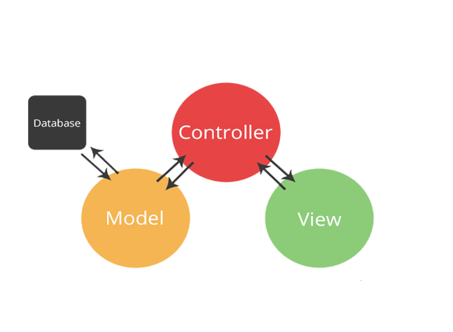

## Vanilla-Trello

바닐라js로 만들어진 Trello 웹어플리케이션입니다.  
Trello를 바닐라js와 MVC패턴을 이용해서 개발해보고 싶다는 생각으로 시작하게된 개인 프로젝트입니다.

## 프로젝트 컨셉(MVC패턴)

 <br/>

간단하게 컨셉을 설명하자면 <br/>
View(화면)에서 유저가 어떤 동작을 취하게되면 Controller는 해당 동작을 감지하게되고 감지된 동작에 따라 데이터에 접근할수있는 Model을 실행시킵니다.  
그런 다음 Model은 controller에 데이터를 전달해주고 controller는 가져온 데이터를 사용해서 화면을 그려냅니다.

## View

components

- BoardList.js
- BoardItem.js
- TodoList.js
- TodoItem.js

해당 컴포넌트들로 구성되어있고 각 컴포넌트에서 templete에 화면에 뿌릴 마크업을 넣어뒀습니다.

```js
export default class BoardItem {
  templete() {
    return `
      <div>
        <p>BoardItem 컴포넌트</p>
      </div>
    `;
  }
}
```

<br/>

## Controller

controller

- index.js

controller에서는 View에서 전달받은 templete을 사용해 화면을 그려줍니다.
render함수롤 만들어줬고 Contreller가 생성될 당시와 데이터가 변경될때마다 render함수를 실행해 화면을 갱신해줍니다.

```js
export default class Controller {
  constructor(model) {
    this.model = model;
    this.BoardList = new BoardList();
    this.boardContainer = $(".boardContainer");

    this.addBoard();
    this.addTodo();
    ...

    this.render();
  }

  render() {
    this.boardContainer.innerHTML = this.BoardList.templete(this.model.getData());
  }

  addBoard() {
    ...
  }
  addTodo(){
    ...
  }
  ...
}
```

contreller는 View에서 사용자의 요청을 받고 요청에 필요한 데이터를 Model을 통해 가져오게됩니다.

- addBoard (boardItem 등록)
- deleteBoard (boardItem 삭제)
- editBoardData (boardItem 수정)
- addTodo (todoItem 추가)
- deleteTodo (todoItem 삭제)
- editTodoData(todoItem 수정)
  <br/>

## Model

model

- index.js

현재 프로젝트에서 데이터 저장소는 로컬스토리지를 사용하고 있습니다.  
Model에서는 데이터를 컨트롤하는 여러 메소드들을 포함하고 있습니다.

```js
export default class Model {
  constructor() {
    if (!this.getData()) {
      localStorage.setItem("boards", "[]");
    }
  }
  getData(key = "boards") {
    const getData = JSON.parse(localStorage.getItem(key));
    if (getData === null) false;
    return getData;
  }
  ...
}
```

- getData (전체 board 데이터 조회)
- setBoardData (board 데이터 추가)
- deleteBoardData (board 데이터 삭제)
- editBoardData (board 데이터 수정)
- setTodoData (todo 데이터 추가)
- deleteTodoData (todo 데이터 삭제)
- editTodoData (todo 데이터 수정)
